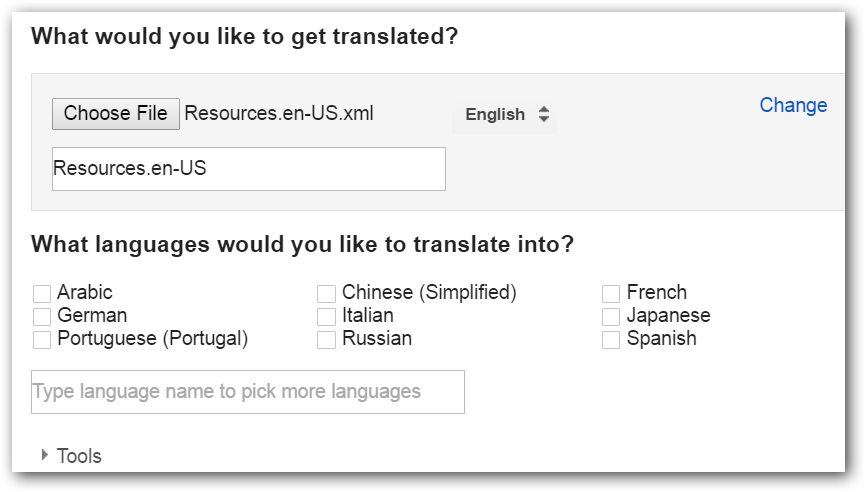
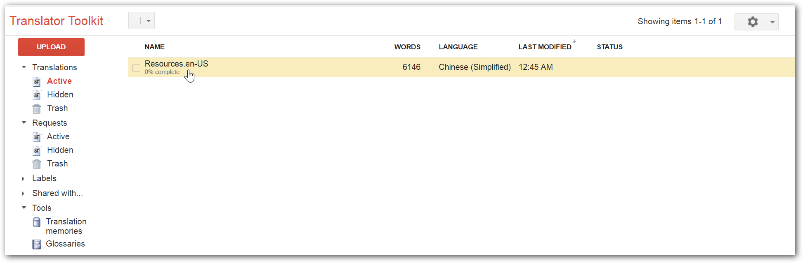
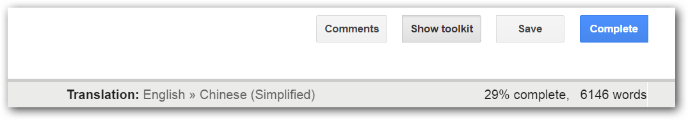
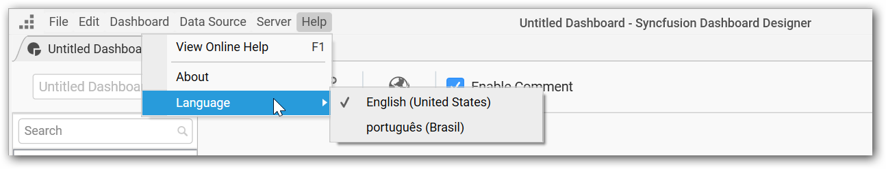
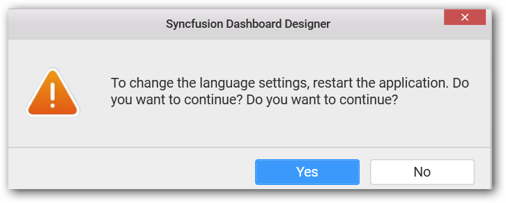

# Adding new localizations

Create your own culture texts for the Syncfusion Dashboard Designer and add it in the application anytime.

To make Syncfusion Dashboard Designer use a different culture perform the following steps:

1. Open [Google Translator Kit](https://translate.google.com/toolkit). Click on Upload button.

    

    It will open a new window to upload the existing culture file en-us. Then click on Add `content to translate` link in the screen.

    

    Select Upload file option in the dropdown.

2. Convert the default resource file **Resources.en-US.resx** from `.resx` format to `.txt` file using [Resource File Generator](https://msdn.microsoft.com/en-us/library/ccec7sz1(v=vs.110).aspx)  or convert to  `.xml` format using any converter tool. The default resource file is available in the following location
`C:\Program Files (x86)\Syncfusion\Dashboard Designer\DashboardDesigner\Localization`

3. Upload converted Resources.en-US.xml or Resources.en-US.txt file which contains the texts from the Dashboard Designer application.

    Make sure that the source language is in `English`.

    

4. Select your desired language in the listed language and click `Next`.

5. In the next screen, `select Start Order`, if you need the paid service on translation; otherwise select `No, thanks`.

    

6. The uploaded file will be listed in the home page of translator kit. Click on the file to open it and make any corrections in the translation if needed.

    

7. Click on `Complete` on the right-top corner of the page to complete the translation.
   
   

8. `Download` your translated .xml file.

    

9.  Convert the `.xml` file to the `.resx` format using any converter tool or use the [Resource File Generator](https://msdn.microsoft.com/en-us/library/ccec7sz1(v=vs.110).aspx) to covert to `.resx` if you are using `.txt` file.

10. Rename the translated file as `Resources.<culturename>.resx`. Here, the culture name illustrates the codes of language and country. For example, you have to specify the file name as `Resources.fr-FR.resx` for `French` culture.

11. Close any instance of Syncfusion Dashboard Designer application kept open, so as to get the above changes into effect.

12. Open the Syncfusion Dashboard Designer where the newly added language will be listed in languages list under the `Help->Language` menu item.

    

13. Select the language from that list

    

14. The culture change requires the closure of the Syncfusion Dashboard Designer to get the selected language take into effect during next startup of the Dashboard Designer.

     

15. You can see the culture changes are  reflected in the Syncfusion Dashboard Designer. 

    
