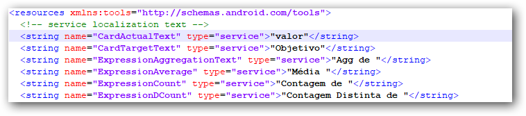

# Adding new localizations

Create your own culture texts for the Syncfusion Dashboard Viewer and add it in the application anytime.

To make Syncfusion Dashboard Server use a different culture perform any one method from the below.

## Method 1: Adding new localizations manually 

Make the copy of the default resource file (Resources.en-US.xml) in the Dashboard Viewer application folder. The attribute `name` holds the actual message. The `XML element` holds the localized value of that message. If you want to show the localized value in your application, you can add the localization message in the corresponding `XML element` field.

To add the localization message, please follow the steps below

1.	Go to the localization folder in the below location and open the duplicate `Resources.en-US.xml`.

    **Dashboard Designer Preview**: %ProgramData%\Syncfusion\DashboardDesigner\                                                      <Dashboard Version>\IISExpress_DashboardService\Localization

    **Dashboard Platform SDK**: %localappdata%\Syncfusion\Dashboard Platform SDK\Service\Localization

    **Dashboard Server**: C:\Syncfusion\Dashboard Server\DashboardServer.Web\API\Localization

2.	You can add your localization message inside the `XMl tag element` within the double quote. (E.g. “valor”, “Objetivo”)

    
 
3.	Rename edited XML filename (E.g. Resources.pt-BR.xml). And keep that resource file in the above-mentioned setup installation location.

    

## Method 2: Using Google Translator Kit

1. Open [Google Translator Kit](https://translate.google.com/toolkit). Click on Upload button.

    

    It will open a new window to upload the existing culture file en-us. Then click on Add `content to translate` link in the screen.

    

    Select Upload file option in the dropdown.

2. Upload the default Resources.en-US.xml file which contains the texts from the Dashboard Viewer application.

   The default resource file is available in the following locations

   **Dashboard Designer Preview**: %ProgramData%\Syncfusion\DashboardDesigner\<DashboardVersion>\IISExpress_DashboardService\Localization\Resources.en-US.xml

   **Dashboard Platform SDK**: %localappdata%\Syncfusion\Dashboard\Samples\Common\Service\Localization\Resources.en-US.xml

   **Dashboard Server**: C:\Program Files (x86)\Syncfusion\Dashboard Server\DashboardServer.Web\DashboardService\Localization\Resources.en-US.xml

   Make sure that the source language is in 'English'.

   

3. Select your desired language in the listed language and click `Next`.

4. In the next screen, `select Start Order`, if you need the paid service on translation; otherwise select `No, thanks`.

    

5. The uploaded file will be listed in the home page of translator kit. Click on the file to open it and make any corrections in the translation if needed.

    

6. Click on `Complete` on the right-top corner of the page to complete the translation.
   
   

7. `Download` your translated .xml file.

    

8. Rename the translated file as `Resources.<culturename>.xml`. Here, the culture name illustrates the codes of language and country. For example, you have to specify the file name as `Resources.fr-FR.xml` for `French` culture.

Note: We have predefined culture files and downloaded at [Available Languages](https://github.com/syncfusion/dashboarddesigner-global/tree/master/Dashboard%20Viewer/Locale)
