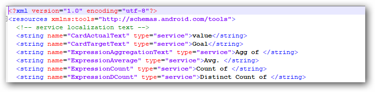

# Editing the localization messages

Localized message files can be edited and changed for any specific texts.

> Read [How to add new localization](/Dashboard Viewer/How-to-add-new-localizations.md) and upload the file and translate to the desired language before editing it.

## Method 1: Editing localization values

You can directly edit the localization message in that `Resourses.en-US.xml` file.

1.	Go to the localization folder in the below location and open the resource file `Resources.en-US.xml`.

    **Dashboard Designer Preview**: %ProgramData%\Syncfusion\DashboardDesigner\\<Dashboard Version\>                                        \IISExpress_DashboardService\Localization

    **Dashboard Platform SDK**: %localappdata%\Syncfusion\Dashboard Platform SDK\Service\Localization

    **Dashboard Server**: C:\Syncfusion\Dashboard Server\DashboardServer.Web\API\Localization

1.	Find the XML attribute for which you want to edit the localization message and replace the localization message inside the `XML element` field (E.g. value, Goal) as below.

    

Localization will be updated on next page refresh.

## Method 2: Using Google Translator kit

1. After converting the localized messages, Open the file and modify the words and sentences which you want to change in the window.

    

2.  Click on `Complete` on the right-top corner of the page to complete the translation.

    

3. `Download` your translated `.xml` file and replace the original `.xml` file with the downloaded file.    
